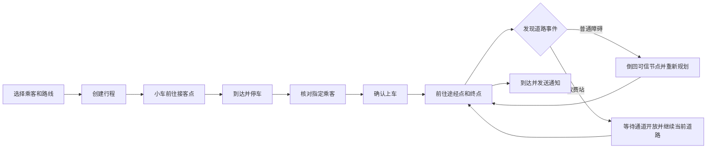
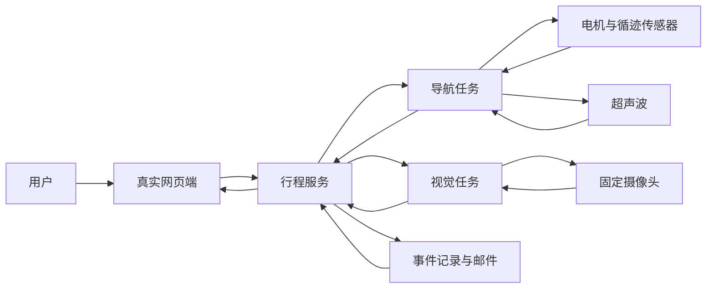

# Yahboom 4WD 智能小车项目汇报 PPT 完整大纲（流程重构版）

## 1. 汇报目标

本套 PPT 的目标不是罗列完成了多少算法或硬件模块，而是先让老师看到一辆智能小车如何完成一张真实行程单，再解释各个单项功能如何支撑这次完整服务。

整场汇报只传达一个核心结论：

> 用户在网页端创建行程后，小车能够完成接客、指定乘客身份核对、多目标导航、道路事件处理、到达通知和过程留痕。

叙事采用“先整体、后局部”，但“整体”不再拆成产品定义、产品价值、功能全景等并列页面，而是直接按照一次行程发生的先后顺序推进：

```text
创建行程
→ 小车前往接客点
→ 到达并停车
→ 核对指定乘客
→ 用户确认上车
→ 前往途经点和终点
→ 处理普通障碍或收费站
→ 到达、通知并保存记录
```

完整行程讲完后，只用一页系统协作总图集中说明网页端、行程服务、算法任务与硬件之间的关系。后半部分再分别介绍前端、A*、循迹、超声波、人脸识别、颜色识别、二维码、邮件和事件记录等独立模块。

## 2. 上一版结构存在的问题

### 2.1 产品概念重复

产品定位、项目价值、核心能力和功能全景本质上都在回答“项目能做什么”，连续拆成多页后没有形成故事推进。

修正方式：封面后直接进入一次完整行程，用车辆实际行为体现产品能力。

### 2.2 行程流程与功能模块反复交叉

人脸识别、障碍处理、邮件等内容既在整体流程中详细说明，又在模块部分再次说明，导致前后重复。

修正方式：

- 前半部分只讲“这一刻用户和小车发生了什么”。
- 后半部分只讲“这个模块接受什么输入、如何处理、输出什么结果”。
- 前后端怎样协作只在系统协作总图中集中说明。

### 2.3 普通障碍与收费站混在同一页

两者的车辆动作完全不同：普通障碍需要倒车、封边和重新规划；收费站需要停车等待，通道恢复后继续当前道路。

修正方式：拆成两个连续分支页，分别讲清处理逻辑。

### 2.4 页面承担的任务过多

部分页面同时出现路线、传感器、视觉、记录和前端操作，导致老师无法快速抓住重点。

修正方式：每页只保留一个主要结论、一个主画面和一条必要流程。

### 2.5 演示证据不足

使用图形块重新绘制网页，会让真实完成的功能看起来像概念设计。

修正方式：

- 网页页面全部使用真实前端截图。
- 人脸识别使用此前保存的真实识别照片。
- 障碍和收费站使用实机视频帧及真实记录图片。
- 到达通知使用真实邮件收件截图。
- 前端缺失的完整录屏通过“成功行程回放模式”在真实网页中复现并截图。

## 3. 整套 PPT 结构

建议使用 25 页主汇报和 4 页附录。

### 第一部分：一次完整行程（第 1—12 页）

按照时间顺序讲清一张行程单如何从网页操作变成真实车辆服务。

### 第二部分：系统协作与独立模块（第 13—23 页）

第 13 页集中说明系统协作，第 14 页以后逐项介绍独立功能。

### 第三部分：完整演示与总结（第 24—25 页）

用连续视频重新汇聚全部功能，并用产品闭环收束。

### 附录（A1—A4）

放置声光提示、全景与图片传输、关键参数和团队分工，不打断主产品故事。

---

# 第一部分：一次完整行程

## 第 1 页｜封面

### 页面标题

**Yahboom 4WD 智能接驳小车**

副标题：面向校园网格道路的自主叫车与乘客接驳系统

一句话定位：用户在线创建行程，小车完成接客、行驶、道路事件处理和到达通知。

### 页面任务

只建立项目身份和使用场景，不提前罗列功能。

### 画面安排

- 使用小车实机运行视频中车体完整、道路关系清楚的一帧作为整页主视觉。
- 标题放在画面留白区域。
- 页面只保留项目名称、副标题、团队和日期。

### 不应出现

- 功能矩阵。
- 产品价值口号。
- 技术名词堆叠。
- 模拟网页或程序界面。

---

## 第 2 页｜一次叫车任务的完整路线图

### 页面标题

**一次叫车任务，按八个步骤完成**

### 核心内容



### 页面任务

先给观众一张完整路线图。第 3—12 页严格沿着这张图逐步展开，不再另外增加产品定义、价值和能力全景页面。

### 画面安排

- 大流程图占页面主体。
- 每个主要步骤放一张不同时间点的真实小图。
- 普通障碍和收费站从主线向下分叉，处理后重新回到行驶主线。

---

## 第 3 页｜步骤 1：用户创建行程

### 页面标题

**用户先确定乘客和整段路线**

### 页面内容

- 选择已登记乘客。
- 设置接客点。
- 添加零至三个途经点。
- 选择目的地。
- 在 5×5 网格上查看路线预览。
- 创建行程后锁定本次乘客和路线。

### 页面流程

```text
选择乘客 → 选择接客点 → 添加途经点 → 选择终点 → 预览路线 → 创建行程
```

### 真实素材

从前端成功行程回放中截取三张连续画面：

1. 填写乘客和点位。
2. 生成路线预览。
3. 行程创建成功，页面进入“来车中”。

截图只保留真实产品页面，裁掉浏览器标签栏、地址栏、桌面和聊天窗口。

### 本页不讲

- A* 如何计算路线。
- 后端接口字段。
- 小车怎样循迹。

---

## 第 4 页｜步骤 2：小车接单并前往接客点

### 页面标题

**行程创建后，小车立即前往接客点**

### 页面内容

- 系统从小车当前可信位置规划到接客点。
- 小车按照节点路径完成转向、出点和循迹行驶。
- 页面持续显示当前位置、路线进度和来车状态。

### 画面安排

- 左侧：真实前端“来车中”状态截图。
- 右侧：小车沿黑线前往接客点的实机视频帧。
- 中间只使用一条方向箭头连接线上任务和线下车辆动作。

### 本页不讲

- A* 搜索过程。
- 四路循迹传感器的具体判断。
- 前后端接口调用。

---

## 第 5 页｜步骤 3：到达接客点并停车

### 页面标题

**进入接客节点后，小车停车并开始接客**

### 页面内容

- 小车稳定进入接客点对应节点后更新当前位置。
- 电机先停止，再进入乘客身份核对阶段。
- 系统形成接客点到达事件。
- 接客点到达通知在后台发送。

### 画面安排

- 使用“进入节点”和“完全停车”两张连续实机帧。
- 页面一角放真实前端到达状态和消息区域。
- 画面必须能看清网格节点与车辆停止状态。

### 本页重点

“到达”是小车真实进入可信节点后的结果，不是网页进度条自行变化。

---

## 第 6 页｜步骤 4：核对指定乘客

### 页面标题

**固定摄像头只核对本次行程指定乘客**

### 页面内容

- 固定摄像头连续采集乘客正面画面。
- 系统只与本次行程绑定的人脸样本比对。
- 人脸识别期间小车保持停车。
- 页面显示识别结果和现场关键画面。

### 真实素材

- 使用此前成功行程保存的人脸识别照片。
- 在真实前端回放中，将该照片显示在人脸识别成功区域。
- 页面只标注乘客姓名、人脸框和识别结果，不展示控制台日志。

### 页面结构

- 左侧约三分之二：真实人脸识别画面。
- 右侧约三分之一：一句结论和三步简化流程。

```text
采集画面 → 与指定乘客样本比对 → 输出匹配结果
```

---

## 第 7 页｜步骤 5：乘客确认上车

### 页面标题

**乘客确认上车后，行程才继续**

### 页面内容

- 识别结果出现后，小车仍停在接客点。
- 乘客查看现场图片并点击“确认上车”。
- 确认完成后，车辆进入载客行驶阶段。
- 如果本次识别没有得到结果，可以重新发起，人车不会自动离开。

### 页面流程

```text
身份匹配 → 保持停车 → 用户确认上车 → 开始载客行驶
```

### 真实素材

- 真实前端中显示此前保存的人脸照片。
- 截取“确认上车”按钮可用时的完整界面。
- 同页配一张小车在接客点静止的实拍画面。

### 本页重点

身份识别和车辆发车是两个独立动作，人工确认是明确的发车条件。

---

## 第 8 页｜步骤 6：依次前往途经点和终点

### 页面标题

**小车按途经点顺序逐段完成路线**

### 页面内容

- 行驶顺序为途经点 1、途经点 2、途经点 3、终点。
- 每到达一个目标点，再从当前位置规划下一段。
- 小车只有稳定进入节点后才更新软件坐标。
- 前端同步显示已走路径、当前位置和下一目标。

### 画面安排

- 中间使用一张真实 5×5 网格路线图。
- 路线周围放三张不同的实机画面：转向、边中循迹、进入节点。
- 不重复使用第 4 页的车辆画面。

### 本页不讲

- 循迹状态判断表。
- A* 开放列表或源代码。
- 超声波与视觉识别。

---

## 第 9 页｜步骤 7：发现前方障碍并停车

### 页面标题

**前方持续出现近距离物体时，小车先停车**

### 页面内容

- 超声波持续发布新的距离读数。
- 连续读数低于安全距离后确认前方存在物体。
- 导航层立即制动。
- 车辆停车后再启动颜色和二维码识别。
- 视觉识别期间小车保持静止。

### 页面流程

```text
新距离读数 → 连续近距离 → 停车 → 获取视觉画面 → 选择处理分支
```

### 画面安排

- 使用小车接近障碍物到完全停车的两至三张连续实机帧。
- 标注超声波方向、障碍物位置和停车位置。
- 本页只讲两种分支共同的“发现并停车”，不提前讲绕行或放行。

---

## 第 10 页｜步骤 7A：普通障碍绕行

### 页面标题

**普通障碍使当前道路暂时不可通行**

### 页面内容

- 红色标记被识别为普通障碍。
- 系统封锁车辆正在行驶的当前道路边。
- 小车沿原路倒回起始可信节点。
- A* 避开被封锁道路重新生成路线。
- 小车沿新路线继续前往原目标。

### 页面流程

```text
识别红色 → 封锁当前边 → 倒回可信节点 → 重新规划 → 沿新路线继续
```

### 真实素材

- 停车画面。
- 开始倒车画面。
- 回到节点画面。
- 改走另一条道路的画面。
- 一张原路线和新路线的对比图。

### 本页不出现

- 蓝色标记。
- 收费站二维码。
- 人工移除挡板。

---

## 第 11 页｜步骤 7B：收费站识别与放行

### 页面标题

**收费站移除挡板后，小车继续当前道路**

### 页面内容

- 蓝色标记只表示前方可能是收费站。
- 有效二维码内容 `TOLL:<station_id>` 确认收费站身份。
- 小车停车等待人工移除挡板。
- 超声波只统计进入等待状态之后的新读数。
- 前方连续恢复安全距离后，从停车位置继续当前道路。

### 页面流程

```text
稳定蓝色 → 扫描有效二维码 → 等待移除挡板 → 连续安全距离 → 继续当前道路
```

### 真实素材

1. 蓝色标志画面。
2. 二维码清晰画面和局部放大。
3. 人工移除挡板。
4. 小车从原停车位置继续行驶。

### 本页重点

收费站不会触发封边和重新规划，小车恢复后继续当前道路。

---

## 第 12 页｜步骤 8：到达、通知和留痕

### 页面标题

**到达目标点后，系统同步进度并留下记录**

### 页面内容

- 到达接客点、途经点和终点时更新行程进度。
- 每次到点生成对应事件。
- 邮件通知在后台发送，不阻塞车辆后续动作。
- 人脸结果、障碍处理、收费站编号和现场图片形成记录。
- 到达终点后释放当前活动行程，车辆回到空闲状态。

### 画面安排

- 终点到达实机画面作为主图。
- 右侧放真实邮件收件截图。
- 下方放真实前端消息时间线和障碍记录截图。

### 页面作用

闭合从第 3 页开始的产品故事。到这一页为止，老师已经看完一次完整接驳服务。

---

# 第二部分：系统协作与独立模块

## 第 13 页｜系统协作总图

### 页面标题

**一张行程单驱动整套软硬件协同**

### 页面任务

这是整套 PPT 中唯一集中说明跨模块协作的页面。后续独立模块页不再反复解释前端如何调用后端。

### 系统流程



### 页面内容

- 网页端负责行程输入、用户操作和状态展示。
- 行程服务维护唯一活动行程，并决定当前执行阶段。
- 导航、视觉、记录和邮件模块分别返回明确结果。
- 硬件层执行电机、循迹、测距和摄像头操作。

### 画面安排

- 左端使用真实前端截图。
- 右端使用小车实拍图。
- 中间使用一张简洁流程图，避免模块目录树和接口清单。

---

## 第 14 页｜独立模块：网页端行程中心

### 页面标题

**网页端集中完成行程创建与状态查看**

### 模块输入

- 乘客。
- 接客点。
- 途经点。
- 目的地。

### 模块功能

- 展示 5×5 网格和路线预览。
- 展示小车当前位置、下一目标和行程阶段。
- 提供创建行程、重新识别、确认上车和取消行程操作。
- 展示消息时间线、现场图片和障碍记录。

### 模块输出

用户能够在同一个真实页面中完成操作并查看完整反馈。

### 真实素材

使用成功行程回放模式，将此前保存的事件按时间顺序重新显示在真实网页中，截取信息最完整的一帧。用四个编号引线标出输入区、网格、状态区和记录区。

### 本页不讲

- HTTP 接口列表。
- 后端类名。
- 行程服务内部状态机。

---

## 第 15 页｜独立模块：A* 路径规划

### 页面标题

**A* 根据网格和禁行边生成节点路径**

### 输入

- 网格地图。
- 起始节点。
- 目标节点。
- 动态禁行边。

### 实现流程

```text
地图、起点、终点、禁行边
→ 计算已走代价和预计剩余代价
→ 选择下一搜索节点
→ 回溯得到节点路径
```

### 输出

由相邻可信节点组成的路径序列，例如：

```text
C3 → B3 → B2 → A2
```

### 画面安排

在同一张 5×5 地图上对比：

- 没有障碍时的原路线。
- 一条道路被封锁后的新路线。

不展示源代码、控制台输出或复杂数学推导。

---

## 第 16 页｜独立模块：循迹与可信节点导航

### 页面标题

**四路循迹传感器把节点路径转换为车辆动作**

### 输入

- 四路黑白读数。
- 当前朝向。
- 目标方向。
- 下一节点。

### 实现流程

```text
AT_NODE
→ ALIGN_TO_EDGE
→ LEAVE_NODE
→ EDGE_TRAVEL
→ REACHED_NEXT_NODE
```

对应车辆动作：

1. 在可信节点上确定下一条道路。
2. 转向并重新找到目标黑线。
3. 离开当前节点。
4. 沿道路进行左右修正。
5. 稳定进入下一节点。

### 输出

- 成功到达下一可信节点。
- 或返回当前道路执行失败及对应原因。

### 真实素材

使用三张连续实机帧：转向、边中循迹、进入节点。软件位置更新点只标在“进入节点”之后。

---

## 第 17 页｜独立模块：超声波障碍检测

### 页面标题

**新鲜距离读数连续低于 20 cm 时触发障碍**

### 输入

- 超声波回波时间。
- 递增的读数序号。

### 实现流程

```text
回波时间
→ 换算距离
→ 忽略进入当前道路之前的旧缓存
→ 连续两条新读数低于20 cm
→ 输出障碍事件
```

### 输出

- 是否存在障碍。
- 最后一次有效距离。
- 对应的当前计划道路边。

### 画面安排

- 超声波模块近景。
- 小车接近障碍物的实拍画面。
- 一条简洁距离变化线和 20 cm 阈值线。

本页不解释颜色和二维码，超声波模块只回答“前方是否存在近距离物体”。

---

## 第 18 页｜独立模块：人脸识别

### 页面标题

**人脸模块核对画面与指定乘客样本**

### 输入

- 固定摄像头画面。
- 指定乘客样本。
- 乘客标签。

### 实现流程

```text
摄像头帧和指定样本
→ 人脸检测
→ 特征编码
→ 计算特征距离
→ 与0.36阈值比较
→ 输出匹配结果
```

### 输出

- 乘客身份。
- 识别距离。
- 识别时间。
- 一张关键帧图片。

### 真实素材

- 左侧显示此前成功行程保存的真实人脸识别照片。
- 右侧显示五步流程和实际识别结果。
- 不出现确认上车按钮、邮件或路线信息，保持模块独立。

---

## 第 19 页｜独立模块：颜色识别

### 页面标题

**颜色模块从画面中提取稳定红色或蓝色区域**

### 输入

固定摄像头连续画面。

### 实现流程

```text
连续画面
→ 转换HSV颜色空间
→ 生成红色和蓝色掩膜
→ 计算有效区域
→ 连续两帧确认同色
→ 输出颜色结果
```

### 输出

- `red`。
- `blue`。
- 无稳定颜色结果及原因。
- 对应关键帧。

### 真实素材

- 一张真实红色目标画面。
- 一张真实蓝色目标画面。
- 画面上只保留识别框、颜色名称和必要的区域标注。

### 本页不讲

- 普通障碍如何倒车。
- 收费站如何放行。
- 前端显示什么按钮。

---

## 第 20 页｜独立模块：二维码识别

### 页面标题

**二维码模块读取并校验收费站编号**

### 输入

摄像头画面中的二维码区域。

### 实现流程

```text
摄像头帧
→ 定位二维码
→ 解码文本
→ 校验 TOLL:<station_id> 格式
→ 输出收费站编号
```

### 输出

- 有效收费站编号。
- 或无效内容及对应原因。

### 真实素材

- 真实二维码画面。
- 二维码局部放大。
- 解码后的收费站编号。

本页不复述蓝色识别、挡板移除或车辆续行。

---

## 第 21 页｜独立模块：邮件发送

### 页面标题

**到点事件通过邮件主动通知用户**

### 输入

- 事件类型。
- 到达位置。
- 发生时间。
- 收件人配置。

### 实现流程

```text
到点事件 → 生成邮件主题与正文 → 后台SMTP发送 → 用户收件箱
```

### 触发位置

- 接客点。
- 各个途经点。
- 目的地。

### 输出

- 真实到达邮件。
- 邮件发送结果。

邮件发送在后台执行，网络结果不改变车辆当前行程。

### 真实素材

使用真实收件箱截图，突出邮件主题、位置和时间。裁掉邮箱账号、地址和无关邮件，不展示授权码或密码。

---

## 第 22 页｜独立模块：事件与图片记录

### 页面标题

**识别与道路事件以图片和结构化记录留存**

### 人脸记录

- 乘客标签。
- 识别结果。
- 时间。
- 识别距离。
- 关键帧图片。

### 障碍记录

- 所属行程。
- 障碍所在道路边。
- 确认距离。
- 颜色。
- 收费站编号。
- 最终处理动作。
- 是否倒回及恢复节点。
- 现场图片。

### 存储方式

```text
识别或道路事件 → 选择关键帧 → 保存同名JPEG与JSON → 前端记录页查询
```

### 真实素材

- 真实障碍记录页。
- 一组实际 JPEG 和 JSON 对应文件。
- 此前成功人脸识别图片。

不绘制虚构数据库后台，不制作没有真实数据支撑的统计图。

---

## 第 23 页｜独立模块：取消与安全停车

### 页面标题

**取消动作取决于小车所在的真实位置**

### 场景一：小车停在可信节点

接客点人脸识别、等待重新识别或等待确认上车时，小车本身已经停车，可以直接结束行程。

### 场景二：小车正在普通道路上行驶

车辆继续进入前方下一个可信节点，停车后结束行程。

### 场景三：小车正在障碍识别或收费站等待

停止当前视觉任务，封锁当前道路，倒回起始可信节点后结束行程。

### 服务关闭或紧急停止

立即制动并释放相关资源。

### 画面安排

使用三条位置分支图，分别标出：当前位置、执行动作和最终停车位置。安全表述只覆盖当前业务流程中明确处理的状态，不扩展为对所有未知程序异常的绝对承诺。

---

# 第三部分：完整演示与总结

## 第 24 页｜完整产品演示

### 页面标题

**完整演示：从创建行程到到达终点**

### 视频时间线

1. 选择乘客和路线。
2. 创建行程。
3. 小车前往接客点。
4. 到达并完成人脸识别。
5. 用户确认上车。
6. 小车前往途经点。
7. 普通障碍倒车并重新规划。
8. 收费站识别并等待放行。
9. 到达目的地。
10. 展示邮件和事件记录。

### 画面安排

- 中心播放一条连续完整视频。
- 右侧使用与第 2 页一致的步骤时间线。
- 视频字幕只显示当前步骤和车辆处理结果。
- 不把多个无顺序短视频平铺成素材墙。

### 前端画面来源

由于原实机完整运行没有留下电脑录屏，前端部分通过真实网页的成功行程回放模式重新录制：

- 按此前成功记录的顺序逐条显示消息。
- 恢复对应路线、位置和行程状态。
- 在人脸识别成功区域显示此前保存的真实人脸照片。
- 在障碍记录区域显示此前保存的真实现场图片和处理结果。
- 回放模式不连接电机，不占用摄像头，不触发真实小车动作。

---

## 第 25 页｜总结

### 页面标题

**我们完成了一次可执行、可处理、可追溯的智能接驳服务**

### 页面内容

- **可执行**：网页创建行程后，小车完成接客与多目标行驶。
- **可处理**：普通障碍触发改道，收费站开放后继续当前道路。
- **可追溯**：身份、道路事件、现场图片和到达邮件形成完整记录。

### 收尾文案

> 我们完成的不是多个互相独立的功能，而是一辆能够连续完成接驳服务的智能小车。

### 画面安排

使用终点到达画面或团队与小车合影作为整页背景。不要再增加新技术内容，也不单独增加只有“谢谢”二字的空白页。

---

# 附录

## 第 A1 页｜行车灯与倒车提示

### 页面标题

**声光提示表达车辆当前动作**

### 页面内容

- 行车灯根据前进、转向和停止状态切换。
- 倒车期间蜂鸣器提供间歇提示。
- 动作结束后灯光和蜂鸣器恢复安全状态。

### 真实素材

使用行车灯、蜂鸣器或倒车雷达的实机视频帧。该页明确标记为独立演示功能，不将声光提示包装成主导航决策。

---

## 第 A2 页｜全景拍摄与图片传输

### 页面标题

**小车可采集多方向画面并传输现场图片**

### 页面内容

- 小车转向或摄像头调整后采集不同方向画面。
- 多张画面形成现场全景或分方向记录。
- 图片可通过局域网传输至接收端。

### 画面安排

```text
不同方向原始画面 → 全景或场景结果 → 接收端图片
```

该功能与主流程中的固定角度人脸、颜色和二维码摄像头任务分开说明。

---

## 第 A3 页｜关键运行参数

### 页面标题

**主要运行参数**

| 类别 | 参数 |
| --- | --- |
| 导航地图 | 5×5 正交网格 |
| 障碍距离 | 有效距离小于 20 cm |
| 障碍确认 | 连续 2 条新鲜距离读数 |
| 颜色确认 | 连续 2 帧同色 |
| 收费站放行 | 距离不小于 20 cm，连续 3 条新读数畅通 |
| 人脸识别 | 距离阈值 0.36，单次最长 20 秒 |

本页只展示老师可能追问的核心参数，不放完整配置文件、敏感信息和全部 GPIO 引脚。

---

## 第 A4 页｜团队分工与模块对应

### 页面标题

**团队按硬件、感知、算法和集成分工**

### 页面内容

- 底盘与安全：电机、GPIO 生命周期、安全停车。
- 传感器与视觉：循迹、超声波、摄像头、颜色和二维码。
- 算法与任务：A*、循迹策略、障碍策略和状态机。
- 集成与展示：服务入口、前端、邮件、记录和项目材料。

最终制作时补充真实成员姓名，不虚构成员贡献。

---

# 4. 前端成功行程回放与截图方案

## 4.1 目的

此前实机已经完整成功运行过一次，但没有保存前端电脑录屏。因此需要在不重新驱动小车的情况下，让真实前端按照此前成功行程的事实重新展示完整过程，并从中获取 PPT 截图和视频片段。

## 4.2 回放原则

- 使用现有真实前端页面，不制作另一套假网页。
- 使用此前保存的人脸照片、障碍记录和现场图片。
- 消息内容按真实行程顺序出现。
- 回放只改变网页展示状态，不控制电机、舵机、蜂鸣器或 LED。
- 回放不打开摄像头，也不重新运行人脸、颜色或二维码算法。
- 不修改正常实车模式的业务规则。
- 不生成项目中没有发生过的运行数据、精度或结果。

## 4.3 建议回放状态顺序

```text
空闲
→ 行程已创建
→ 前往接客点
→ 到达接客点
→ 正在核对乘客
→ 指定乘客识别成功并显示真实照片
→ 等待确认上车
→ 已确认上车
→ 前往途经点
→ 到达途经点
→ 发现普通障碍
→ 普通障碍识别完成
→ 倒回可信节点
→ 重新规划并继续行驶
→ 发现收费站
→ 蓝色识别完成
→ 二维码识别出收费站编号
→ 等待通道开放
→ 通道开放并继续当前道路
→ 到达目的地
→ 邮件已发送
→ 行程完成
```

如果现有记录中没有某一项事实，则不在回放中增加该项。

## 4.4 必须截取的前端画面

1. 空闲状态的完整首页。
2. 已选择乘客、接客点、途经点和终点。
3. 路线预览。
4. 行程创建成功并显示来车中。
5. 小车到达接客点。
6. 正在进行人脸识别。
7. 人脸识别成功，真实照片显示在结果区域。
8. “确认上车”按钮可用。
9. 已确认上车并前往途经点。
10. 普通障碍消息与真实障碍图片。
11. 重新规划后的路线变化。
12. 收费站颜色识别消息。
13. 二维码识别结果和收费站编号。
14. 等待收费站通道开放。
15. 继续当前道路。
16. 到达途经点。
17. 到达目的地。
18. 完整消息时间线。
19. 障碍记录列表。
20. 真实到达邮件。

## 4.5 截图裁切规则

- 完整页面截图用于介绍网页端整体产品。
- 局部截图用于人脸、路线、消息和记录等单项页面。
- 裁掉浏览器标签栏、地址栏、开发者工具和桌面背景。
- 邮箱账号、收件地址和其他个人信息需要裁掉或遮挡。
- 同一张截图默认只在一页使用。
- 同一原始画面确需跨页使用时，应采用不同裁切范围，并承担不同的叙事任务。

# 5. 模块页统一写法

后半部分每个模块统一回答四个问题：

1. 模块解决什么问题。
2. 模块接受什么输入。
3. 模块内部经过哪些关键步骤。
4. 模块最终输出什么可观察结果。

模块标题不能只写“人脸识别模块”“颜色识别模块”等名词，应写成可以直接讲出口的结论，例如：

- A* 根据网格和禁行边生成节点路径。
- 新鲜距离读数连续低于 20 cm 时触发障碍。
- 人脸模块核对画面与指定乘客样本。
- 颜色模块从画面中提取稳定红色或蓝色区域。
- 到点事件通过邮件主动通知用户。

模块页不再解释前端怎样调用后端，也不重复完整行程状态流转。

# 6. 最终制作约束

- 不再设置产品定义、产品价值、能力全景和核心亮点等连续并列页面。
- 除第 2 页总流程和第 13 页系统协作外，不再绘制跨模块大流程图。
- 主流程页只讲用户和小车发生了什么。
- 模块页只讲单项功能如何实现以及产生什么结果。
- 不展示长代码、控制台日志、文件目录和接口清单。
- 不使用模拟网页、卡片式占位界面或装饰性数据看板。
- 所有界面优先使用真实前端回放截图。
- 所有车辆行为优先使用实机视频帧。
- 不使用阶段性、检查式或模糊状态标签。
- 不虚构识别精度、成功率、运行次数、用户规模或节省时间等没有统计的数据。
- 扩展功能与主接驳流程明确分开，避免声光或全景功能干扰产品主线。
- 安全表述限定在当前实现明确处理的业务状态内。

# 7. 内容依据

- `docs/当前完整业务流程说明.md`
- `docs/后端架构与接口文档.md`
- `docs/当前网格导航行进逻辑与状态机.md`
- `docs/本地人脸识别实机调试与人工智能协作指南.md`
- `docs/颜色识别实机测试说明.md`
- `docs/二维码独立识别实机测试与排错指南.md`
- `docs/障碍抓拍与到点邮件实机验证指南.md`
- `src/algorithms/`
- `src/tasks/`
- `src/hardware/`
- `src/server/`
- `src/services/`
- `src/network/`
