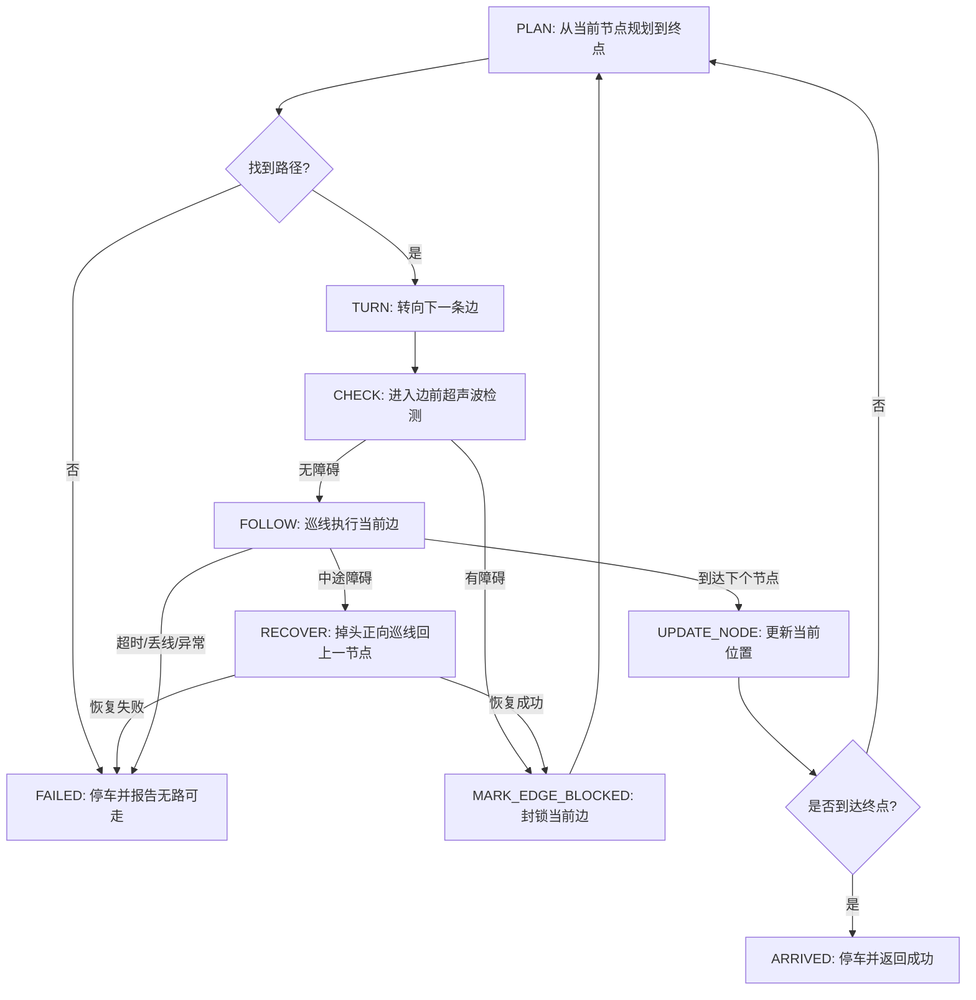

# 网格导航功能模块与执行路径说明

本文说明“黑线网格点到点导航 + 当前边障碍重规划 + 中途障碍掉头回节点恢复”的模块分工和运行路径。

当前仓库已经具备 A*、基础巡线、电机驱动、超声波测距、倒车雷达、边执行器和网格导航状态机等能力。

## 1. 功能口径

- 地面是正交黑线网格，节点是十字路口，节点之间是一条可巡线的黑线边。
- 外框黑线默认也是可行驶路径；地图外不可走。
- 起点、终点、当前位置都用网格节点坐标表示，内部坐标格式为 `(row, col)`。
- 展示给人看时可以把 `(0, 0)` 显示为 `A1`，`(0, 1)` 显示为 `A2`，`(1, 0)` 显示为 `B1`。
- 障碍只支持挡住“当前准备进入的下一条边”，不支持任意位置障碍、视觉建图或 SLAM。
- 中途遇到障碍时，采用“原地掉头 + 正向巡线回上一节点”，不是倒车退回。
- 倒车雷达是提示能力，不等同于倒车回节点能力，不并入第一版主导航执行路径。

## 2. 已有模块

### 2.1 `src/config.py`

集中保存非敏感硬件配置。

- 电机引脚：`MOTOR_IN1`、`MOTOR_IN2`、`MOTOR_IN3`、`MOTOR_IN4`、`MOTOR_ENA`、`MOTOR_ENB`。
- 超声波配置：`ULTRASONIC_TRIG`、`ULTRASONIC_ECHO`、`ULTRASONIC_THRESHOLD`、`ULTRASONIC_TIMEOUT`、`ULTRASONIC_SAMPLES`。
- 四路巡线传感器：`LINE_SENSOR_LEFT_OUTER_PIN`、`LINE_SENSOR_LEFT_INNER_PIN`、`LINE_SENSOR_RIGHT_INNER_PIN`、`LINE_SENSOR_RIGHT_OUTER_PIN`。
- 黑线电平：`LINE_SENSOR_BLACK_VALUE`。

配置层只表达硬件事实，不写业务流程。后续网格导航只读取这些配置，不应该在任务层重复定义 GPIO 引脚。

### 2.2 `src/algorithms/astar.py`

当前已实现二维矩形网格 A*，并支持节点障碍和边障碍。

- `PASSABLE = "A"`：可通行节点。
- `OBSTACLE = "X"`：不可通行节点。
- `Node`：A* 搜索节点，保存 `position`、`parent`、`g`、`h`。
- `heuristic(a, b)`：计算曼哈顿距离。
- `astar(grid, start, end, blocked_edges=None)`：根据节点障碍和可选边障碍规划路径。
- `grid_to_string(grid)`：把网格转成适合打印的字符串。
- `format_path(path)`：把 `(row, col)` 路径转成 `A1` 这类展示文本。

边障碍接口是：

```python
astar(grid, start, end, blocked_edges=None)
```

其中 `blocked_edges` 表示不可通行边，例如：

```python
{
    frozenset({(0, 0), (0, 1)}),
    frozenset({(1, 1), (2, 1)}),
}
```

边按无向处理：`(0, 0) -> (0, 1)` 堵住时，反向也不可走。这样比把下一个节点直接改成 `X` 更准确，因为障碍挡的是路段，不一定挡住节点本身。

### 2.3 `src/hardware/line_sensor.py`

封装四路红外巡线传感器读取，不控制电机。

- `LineReading`：归一化读数，四个字段表示对应传感器是否检测到黑线。
- `LineReading.from_gpio_values(...)`：把 GPIO 原始电平转换成布尔读数。
- `LineSensor.read()`：读取一次四路传感器状态。
- `LineSensor.close()`：释放巡线传感器 GPIO。

这个模块是硬件边界。上层任务不能直接 `GPIO.input()` 读取巡线引脚，应通过 `LineSensor.read()` 获取读数。

### 2.4 `src/tasks/line_follow.py`

封装基础巡线策略和节点检测。

- `is_at_node(reading)`：判断当前读数是否表示到达网格节点。
- `track_node_check(sensor)`：读取一次传感器并判断是否到达节点。
- `decide_line_action(reading)`：根据四路读数决定 `forward`、`left`、`right`、`search_left` 或 `node`。
- `LineFollower.step()`：执行一次“读取传感器 -> 判断动作 -> 控制电机”。
- `LineFollower.run_track(max_seconds, delay_seconds=0.02)`：沿线行驶，直到检测到节点或超时。

`LineFollower` 只知道如何沿黑线走和如何识别节点，不知道当前坐标、下一节点、A* 路径或障碍地图。完整网格导航不能把坐标状态塞进这里，否则巡线层会和导航层耦合。

### 2.5 `src/hardware/motor.py`

封装底盘运动。

- `MotorController.forward(left_speed, right_speed)`：左右电机前进。
- `MotorController.backward(left_speed, right_speed)`：左右电机后退。
- `MotorController.left(left_speed, right_speed)`：普通左转。
- `MotorController.right(left_speed, right_speed)`：普通右转。
- `MotorController.spin_left(left_speed, right_speed)`：原地左旋。
- `MotorController.spin_right(left_speed, right_speed)`：原地右旋。
- `MotorController.brake()`：停车。
- `MotorController.close()`：释放资源。

导航任务只调用这些动作接口，不直接操作电机 GPIO。任何失败、异常、超时或 Ctrl+C 都必须最终触发 `brake()`。

### 2.6 `src/hardware/ultrasonic.py`

封装超声波测距，不控制电机。

- `UltrasonicSensor.read_distance()`：单次测距。
- `UltrasonicSensor.read_filtered()`：多次采样取中位数。
- `UltrasonicSensor.is_obstructed(distance=None)`：判断距离是否低于障碍阈值。
- `UltrasonicSensor.start_monitoring()` / `stop_monitoring()`：后台监测。
- `UltrasonicSensor.close()`：停止监测并释放 GPIO。

第一版网格导航只需要在“准备进入下一条边前”和“沿边行驶过程中”读取前方是否被挡。超声波只产生障碍事实，不负责决定怎么转弯、封边或重规划。

### 2.7 `src/tasks/reverse_radar.py`

封装倒车雷达提示。

- `ReverseRadar.radar_beep(distance_cm)`：按距离改变蜂鸣提示频率。
- `ReverseRadar.start()` / `stop()`：后台循环测距和提示。
- `ReverseRadar.close()`：停止并释放蜂鸣器、超声波资源。

倒车雷达的本质是“距离 -> 蜂鸣提示”。如果超声波安装在车头，它不能保证车尾倒退安全。因此本文中的“回上一节点”采用掉头后正向巡线，不依赖倒车雷达。

## 3. 网格导航模块

### 3.1 `src/tasks/edge_follow.py`

`EdgeFollower` 的职责是执行一条网格边：从当前节点沿黑线走到相邻节点。

主要接口：

```python
class EdgeFollower:
    def follow_edge(self, max_seconds):
        ...

    def recover_to_start_node(self, max_seconds):
        ...
```

`follow_edge()` 的核心流程：

1. 进入边前调用超声波判断前方是否有障碍。
2. 如果有障碍，立即返回 `blocked_before_entering`，不进入该边。
3. 先离开当前十字节点，再开始识别下一个节点，避免把起点误判成终点。
4. 循环调用 `LineFollower.step()` 做基础巡线。
5. 循环中持续检查超声波、节点检测和超时。
6. 到达下一个节点时停车，返回 `reached_node`。
7. 中途遇障碍时停车，返回 `blocked_mid_edge`。
8. 超时、丢线或异常时停车，返回失败状态。

`recover_to_start_node()` 的核心流程：

1. 原地掉头。
2. 使用正向巡线能力沿原边返回上一节点。
3. 到达上一节点后停车。
4. 再次掉头，恢复准备重新规划的朝向。
5. 成功回到可信节点时返回成功；失败时返回失败，导航层不得更新当前位置。

`EdgeFollower` 不保存全局地图，不调用 A*。它只负责“这一条边能不能安全走完”。

### 3.2 `src/tasks/grid_navigation.py`

`GridNavigator` 的职责是完整网格导航状态机。

主要接口：

```python
class GridNavigator:
    def navigate(self, start, end, initial_heading):
        ...
```

`GridNavigator` 保存以下状态：

- `current_node`：当前可信节点。
- `target_node`：终点。
- `current_heading`：当前朝向，建议使用 `north`、`south`、`east`、`west`。
- `static_blocked_edges`：已知不可通行边。
- `dynamic_blocked_edges`：运行中发现的障碍边。
- `grid`：节点地图，仍支持 `"A"` 和 `"X"`。

`GridNavigator` 的职责：

- 调用 A* 规划从当前节点到终点的路径。
- 根据当前节点和下一节点计算目标朝向。
- 调用电机完成转向。
- 调用 `EdgeFollower.follow_edge()` 执行下一条边。
- 遇到障碍时把当前边加入 `dynamic_blocked_edges`。
- 必要时重新调用 A*。
- 只有到达可信节点后，才更新 `current_node`。
- 无路可走、恢复失败、丢线或超时时停车并返回失败。

## 4. 完整执行路径

### 4.1 正常无障碍路径

```text
入口工具解析参数
-> 创建 MotorController / LineSensor / LineFollower / UltrasonicSensor / EdgeFollower / GridNavigator
-> GridNavigator.navigate(start, end, initial_heading)
-> A* 规划路径
-> 取下一节点
-> 根据 current_node 和 next_node 计算目标朝向
-> MotorController.spin_left 或 spin_right 完成转向
-> EdgeFollower.follow_edge()
   -> 进入边前超声波确认无障碍
   -> 离开当前十字节点
   -> LineFollower.step() 循环巡线
   -> 检测到下一个十字节点
   -> brake()
-> GridNavigator 更新 current_node
-> 重复直到 current_node == end
-> 停车并返回成功
```

### 4.2 进入边前发现障碍

```text
当前在 A1，计划走向 A2
-> 转向到 A1->A2
-> EdgeFollower.follow_edge()
   -> UltrasonicSensor.is_obstructed() == True
   -> 不进入该边，brake()
   -> 返回 blocked_before_entering
-> GridNavigator 把 frozenset({A1, A2}) 加入 dynamic_blocked_edges
-> 从 A1 重新调用 A*
-> 如果有新路径，继续执行
-> 如果无路可走，停车并返回失败
```

### 4.3 边中途发现障碍

```text
当前在 A1，正在走向 A2
-> 巡线过程中超声波发现障碍
-> EdgeFollower 立即 brake()
-> 返回 blocked_mid_edge
-> GridNavigator 调用 recover_to_start_node()
   -> 原地掉头
   -> 正向巡线回 A1
   -> 到达 A1 后停车
   -> 再次掉头恢复面向 A2 的方向
-> 恢复成功后，封锁 frozenset({A1, A2})
-> 从 A1 重新 A*
-> 恢复失败时，当前位置不可信，停车并返回失败
```

### 4.4 状态机



## 5. 安全与边界契约

- 所有运动循环必须有 `max_seconds`，不能无限行驶。
- 任何失败状态必须先 `brake()`，再返回。
- 入口层用 `try / finally` 统一关闭硬件对象。
- 组合任务中不要中途调用某个硬件对象的 `close()`，避免清理掉其它模块仍在使用的 GPIO。
- 只有位于可信节点时，`GridNavigator` 才允许更新 `current_node`。
- 中途遇障碍时，恢复成功前不能更新位置，也不能继续规划。
- 障碍边只写入 `blocked_edges`，不要直接把下一个节点改成 `"X"`。
- 地图外边界由矩形 `grid` 控制；外框黑线默认可走。
- 如果实机证明节点检测不稳定，应先调整 `is_at_node()` 和离开节点逻辑，再扩大测试范围。

## 6. 测试与验收建议

### 6.1 本地单元测试

- A* 能在无 `blocked_edges` 时保持现有路径规划行为。
- A* 能绕开 `blocked_edges`。
- A* 拒绝非相邻节点组成的封锁边。
- `EdgeFollower.follow_edge()` 在进入边前遇障碍时，不调用前进动作，直接返回 `blocked_before_entering`。
- `EdgeFollower.follow_edge()` 在中途遇障碍时，停车并返回 `blocked_mid_edge`。
- `GridNavigator.navigate()` 在进入边前遇障碍时，封锁当前边并重新规划。
- `GridNavigator.navigate()` 在中途障碍恢复成功后，从上一节点重新规划。
- `GridNavigator.navigate()` 在恢复失败或无路可走时停车并返回失败。

### 6.2 实机测试顺序

1. 只读测试巡线传感器，确认黑线和白底读数正确。
2. 低速短时测试电机方向，确认 `forward`、`spin_left`、`spin_right` 与实际动作一致。
3. 只读测试超声波，确认阈值能稳定区分障碍。
4. 单独测试 `LineFollower.run_track()`，确认能从一个节点走到下一个节点。
5. 测试无障碍点到点导航。
6. 在当前下一条边前方放置障碍，测试进入边前封边重规划。
7. 在边中途放置障碍，测试掉头回上一节点、封边、重规划。
8. 人为封住所有可行边，确认小车停车并报告无路可走。

成功标准必须是可观察结果：

- 小车没有障碍时能按 A* 路径到达终点。
- 小车遇到当前边障碍时不继续撞入障碍，而是封边重规划。
- 小车中途遇障碍时能回到上一节点；回不去时必须停车失败。
- 任何 Ctrl+C、超时、丢线、异常都不会让电机继续转动。
