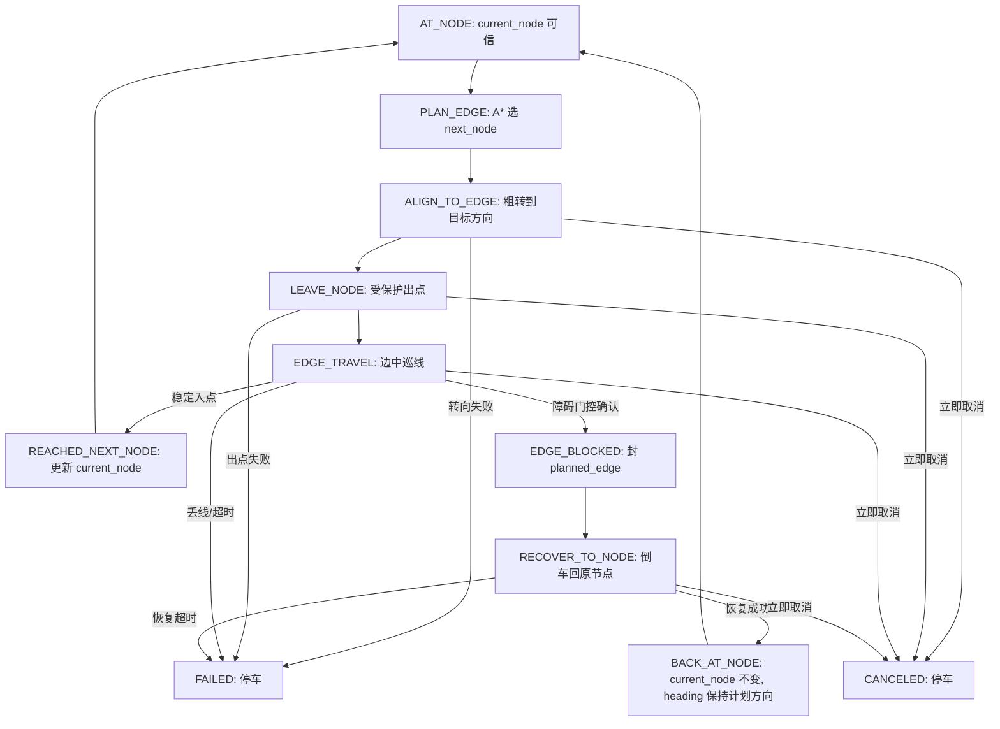

# 当前网格导航行进逻辑与状态机

本文记录当前 `src/tasks/line_follow.py`、`src/tasks/edge_follow.py`、`src/tasks/grid_navigation.py` 和 `src/server/hardware_factory.py` 已实现的真实行为，包括巡线、转向、出点、障碍封边、倒车恢复和重新规划。本文不描述未来设想；文档与代码冲突时，先停止实车测试并重新核对代码。

## 1. 目标与边界

目标场景是正交黑线网格上的点到点导航：

- 节点是十字交叉点，边是两个相邻节点之间的一条黑线。
- 当前位置、起点和终点都用节点坐标表示，例如 `A1`、`A2`、`B2`。
- A* 只规划网格路径，不直接控制车。
- 障碍只表示“当前计划边不可通行”，不表示某个节点永久不可走。
- 不做视觉定位、SLAM、任意障碍识别或真实坐标测量。
- 实车没有编码器和节点编号识别能力，因此只有“稳定进入可信节点”时，软件坐标才可信。

核心原则：

```text
只有在可信节点上才能选边。
只有稳定进入下一个节点后才能更新 current_node。
只有进入边中巡线阶段后才能把 planned_edge 封锁。
转向、出点、恢复期间不能根据超声封新边；边中全白直行仍须停车避障。
```

## 2. 模块职责

### 2.1 不改职责的模块

`src/config.py`

- 保存 GPIO BCM 编号、PWM 频率、阈值等非敏感配置。
- 不写路径规划、巡线动作或障碍处理流程。

`src/algorithms/astar.py`

- 继续负责矩形网格 A*。
- 输入：`grid`、`start`、`end`、`blocked_edges`。
- 输出：节点路径，例如 `[(0, 1), (1, 1), (1, 2), (0, 2)]`。
- `blocked_edges` 仍使用无向边：`frozenset({A2, A3})`。

`src/hardware/line_sensor.py`

- 只负责读取四路巡线传感器并返回 `LineReading`。
- 不判断坐标、不封边、不控制电机。

`src/hardware/motor.py`

- 只封装 `forward`、`left`、`right`、`spin_left`、`spin_right`、`brake`、`close`。
- 不知道网格、节点、障碍或 A*。

`src/hardware/ultrasonic.py`

- 只负责测距和后台更新 `obstacle_detected`、`last_distance`。
- 超声模块本身不知道障碍属于哪条边。
- 是否相信缓存、什么时候封边，由边执行状态机决定。

### 2.2 当前行进编排模块

`src/tasks/line_follow.py`

- 继续提供基础巡线动作判断。
- 把“读数、动作、是否节点、是否看到线”一起返回给上层。
- 默认全白仍表示找线；`EDGE_TRAVEL` 和倒车恢复会按各自上下文把全白解释为直行。
- 不决定坐标、不决定封边、不决定 A*。

当前结果对象：

```python
class LineStepResult:
    reading: LineReading
    action: str
    is_node: bool
    line_seen: bool
    centered_line: bool
```

`src/tasks/edge_follow.py`

- `EdgeFollower` 承载单条计划边的执行和倒车恢复状态机。
- 边执行器只执行“从当前可信节点尝试走向计划相邻节点”。
- 边执行器不调用 A*，不修改全局地图。

当前核心接口：

```python
class EdgeFollower:
    def execute_planned_edge(
        self, current_heading, target_heading, max_seconds, cancel_requested_fn=None
    ):
        ...

    def recover_to_start_node(
        self, return_heading, max_seconds, cancel_requested_fn=None
    ):
        ...
```

`src/tasks/grid_navigation.py`

- 只维护地图状态：`current_node`、`target_node`、`current_heading`、`dynamic_blocked_edges`。
- 只在可信节点上调用 A* 选边。
- 只根据边执行结果更新坐标、朝向和封锁边。

## 3. 关键概念

### 3.1 可信节点

可信节点是软件允许认为“车就在这个网格点”的唯一状态。

满足条件：

- 已经完成入点确认。
- 车在节点附近停车。
- 上一次边执行结果明确返回“到达计划节点”或“恢复回起点节点”。

不可信状态：

- 转向中。
- 出点中。
- 边中巡线。
- 找线中。
- 遇障碍后恢复中。
- 超时、丢线或转向失败后。

### 3.2 计划边

计划边由导航层在可信节点上确定：

```text
planned_edge = frozenset({current_node, next_node})
```

超声只产生“车头前方近距离有物体”的事实，不知道 `A2-A3`、`A2-B2` 这些边名。封哪条边完全由当前 `planned_edge` 决定。

因此必须保证：只有车辆进入 `planned_edge` 的边中巡线阶段后，才能根据超声封这条边。

### 3.3 超声缓存门控

后台超声缓存可能滞后，也可能在转向时扫到上一条边附近的障碍。后台每轮只调用一次 `read_distance()`，立即发布距离、障碍布尔值并递增 `reading_sequence`，然后等待 `0.06` 秒再开始下一轮。边执行器只接受进入当前边之后发布的新序号。

当前门控对象：

```python
class ObstacleGate:
    def start_edge(self):
        self.hit_count = 0
        self.last_sequence = sensor.read_snapshot()[0]

    def check_blocked(self):
        ...
```

新边开始后，障碍门控必须重新记录缓存序号：

- 转向、出点、恢复阶段不根据超声封边。
- 忽略进入当前边之前发布的旧缓存。
- 不要求先读到安全；进入边后连续两条新鲜读数报告障碍即可停车。
- 边中丢线找线时仍检查障碍，不能因巡线不稳定关闭安全检测。
- 只对不同 `reading_sequence` 的新读数计数。
- 有效距离小于 `20 cm` 才是障碍；`-1` 保持当前语义，不判定为障碍。

当前参数：

```text
obstacle_confirm_samples = 2
threshold = 20 cm
```

## 4. 当前状态机

网格导航分两层状态机：

- `GridNavigator`：节点级状态机，只管选边和地图。
- `EdgeFollower`：边级状态机，只管执行当前计划边和障碍后的倒车恢复。

### 4.1 节点级状态机

```text
AT_NODE
  -> 调用 A* 规划 current_node 到 target_node
  -> 无路径时 brake() 并返回 no_path
  -> 取 path[1] 作为 next_node
  -> 生成 planned_edge
  -> 计算 target_heading
  -> 调用 EdgeFollower.execute_planned_edge()

EDGE_RESULT: reached_next_node
  -> current_node = next_node
  -> current_heading = target_heading
  -> 回到 AT_NODE

EDGE_RESULT: blocked_on_planned_edge
  -> dynamic_blocked_edges.add(planned_edge)
  -> 调用 EdgeFollower.recover_to_start_node()

RECOVERY_RESULT: recovered_to_start_node
  -> current_node 不变
  -> current_heading = target_heading
  -> 回到 AT_NODE，重新 A*

任意失败
  -> brake()
  -> 返回 failed

取消
  -> 行进阶段检测到立即取消信号时 brake()
  -> 网页乘客取消采用“到前方下一个可信节点停车”
```

注意：遇到中途障碍时，`current_node` 不更新为 `next_node`。恢复成功后，车头仍朝向原计划边方向，因为恢复动作使用倒车而不是原地掉头。

### 4.2 边级状态机

```text
ALIGN_TO_EDGE
  粗转后按计划方向低速找线
  第一次重新看到目标线后停车
  不读超声
  不认节点
  不封边

LEAVE_NODE
  受保护出点
  直行边以 forward_speed=5 前进
  左右转后以速度5沿同方向画弧
  至少执行0.10秒
  连续全白确认进入目标边
  不读超声
  不认下一个节点

EDGE_TRAVEL
  全白以5直行，左修正80，右修正100
  允许障碍门控检查 current planned_edge
  允许入点确认

EDGE_BLOCKED
  确认障碍后停车
  返回 blocked_on_planned_edge

RECOVER_TO_NODE
  倒车沿原边回原节点
  全白以5直倒，左右当前读数以20修正
  不根据超声封边
  不封新边
  稳定入点后返回 recovered_to_start_node

FAILED
  边执行总超时、走边全白超时、转向失败、出点失败或恢复超时
```

### 4.3 Mermaid 状态图



以上失败状态指代码已经识别并返回的超时、丢线、无路径和取消。当前 `GridNavigator.navigate()` 对 `execute_planned_edge()` 与 `recover_to_start_node()` 的意外 Python 异常还没有最外层 `finally: brake()`，这是尚未消除的安全缺口，不能把“所有异常一定立即停车”写成已实现事实。

## 5. 转向与目标线确认

### 5.1 为什么不能只靠固定时间

固定时间转向会累积误差。车轮阻力、地面摩擦、电量和左右轮差异都会让 90 度或 180 度转向不稳定。

### 5.2 为什么不能在交叉点中心直接用传感器找线

车停在十字交叉点中心时，四路传感器可能同时压到黑线。此时无论车头朝哪个方向，读数都可能像“节点”，无法可靠区分目标边是哪一条。

所以新版转向不是“原地一直转到看到线”，而是：

```text
时间粗转
-> 受保护出点
-> 在离开十字中心后，用传感器确认进入目标边
```

### 5.3 当前转向流程

`ALIGN_TO_EDGE`：

1. 根据 `current_heading` 和 `target_heading` 计算左转、右转或掉头。
2. 按对应方向执行故意不足的预转向。
3. 粗转期间不读超声、不封边、不认节点。
4. 预转完成后，按计划转向方向以速度5继续精细找线。
5. 如果直接读到“内侧两路黑且不是节点”的普通居中线，立即停车；否则先等传感器全白离开旧线，再在第一次重新看到黑线时停车。
6. 停车后进入 `LEAVE_NODE`；5秒内找不到目标线则返回 `turn_failed`。

`LEAVE_NODE`：

1. 未转向时以 `forward_speed=5` 直行驶出十字口。
2. 左转、右转或左掉头后，以相同方向和速度5画弧驶出。
3. 出点阶段不调用普通巡线的80/100修正。
4. 如果仍然看到黑线或节点，继续当前直行或弧线动作，不允许入点。
5. 执行最短出点时间后，连续 `node_clear_samples` 次全白才进入 `EDGE_TRAVEL`。

当前网页实车参数：

```text
left_turn_rough_seconds = 0.4 秒
right_turn_rough_seconds = 0.3 秒
uturn_rough_seconds = 0.8 秒（当前固定左旋）
turn_acquire_timeout = 5.0 秒
search_speed = 5
leave_node_min_seconds = 0.10 秒
node_clear_samples = 1
line_acquire_timeout = 3.0 秒
```

完整90°和180°实测时间仍是 `0.6/0.5/1.2/1.1` 秒；这里的 `0.4/0.3/0.8` 是故意不足的预转向，不表示已经重新测得完整角度。

## 6. 出点逻辑

出点是从可信节点进入计划边的保护阶段。

出点阶段禁止：

- 根据超声封边。
- 把任何节点读数当作下一节点。
- 更新 `current_node`。

因此出点最短 `0.10s` 期间存在一个明确的超声盲区；当前实现只是缩短盲区，没有消除它。

出点成功条件：

```text
已经执行最短出点时间
并且连续 node_clear_samples 次读数全白
```

全白在出点阶段表示黑线已经进入传感器中间。3秒内不能满足最短时间和连续全白条件，则返回失败并停车，不更新坐标。

## 7. 边中巡线逻辑

边中巡线是唯一允许动态超声封边的阶段。

每轮循环：

1. 读取巡线传感器。
2. 四路全白时执行 `forward(5, 5)`；左侧见黑执行 `left(0, 80)`，右侧见黑执行 `right(100, 0)`。
3. 每轮都调用障碍门控，不能因全白直行关闭安全检测。
4. 如果障碍门控确认，返回 `blocked_on_planned_edge`。
5. 如果稳定检测到节点，返回 `reached_next_node`。
6. 连续全白超过 `line_lost_timeout`，按无法区分的真实丢线处理并停车。

当前小车在普通边居中时主要为全白，因此全白直行是 `EDGE_TRAVEL` 的专用策略。全白也可能表示完全出线，单帧无法区分，所以仍保留5秒安全上限。

走边读数按以下优先级解释：

| 读数条件 | 动作 |
| --- | --- |
| `LI=1`、`RI=1`，且 `LO=1` 或 `RO=1` | 节点，先刹车并确认入点 |
| 左内侧单独见黑或左外侧见黑 | `left(0, 80)` |
| 右内侧单独见黑或右外侧见黑 | `right(100, 0)` |
| 只有内侧两路同时见黑 | `forward(5, 5)` |
| 四路全白 | `forward(5, 5)`，同时累计全白安全时间 |

## 8. 入点逻辑

入点是坐标更新的唯一依据。

当前节点判断仍可沿用：

```text
LI = 1
RI = 1
并且 LO = 1 或 RO = 1
```

也就是：

```python
left_inner and right_inner and (left_outer or right_outer)
```

当前实车采用“一次 `node=1` 就到点”。必须满足：

```text
已经完成出点
已经处于 EDGE_TRAVEL
传感器读数满足节点规则
node_confirm_samples = 1，单次检测到节点即确认
```

确认后以当前 `forward_speed` 轻推居中：

```text
node_center_seconds = 0.08 秒
```

然后停车并返回 `reached_next_node`。只有这时 `GridNavigator` 才能执行：

```python
current_node = next_node
current_heading = target_heading
```

## 9. 障碍封边逻辑

新版不使用“进入边前超声封边”作为默认动态障碍逻辑。进入边前只由 A* 避开已知 `blocked_edges`。

动态障碍封边只发生在：

```text
EDGE_TRAVEL
且 planned_edge 已确定
且出点已经完成
且障碍门控已 armed
且进入边后发布的新鲜超声读数小于阈值
```

封边流程：

```text
确认障碍
-> brake()
-> dynamic_blocked_edges.add(planned_edge)
-> 返回 blocked_on_planned_edge
-> 进入恢复
```

如果 `dynamic_blocked_edges=3`，说明程序在三条不同的计划边上都确认过障碍。新版通过缓存序号忽略进入当前边之前发布的旧读数，不再依赖“先读到安全”。

当前 `obstacle_confirm_samples=2`，连续两条不同序号的新鲜障碍读数才会停车；中间任何安全读数都会把累计次数清零。走边单轮处理顺序是：取消检查、执行巡线动作、节点确认、障碍确认、全白超时检查。节点已经确认时会先完成入点，不再把节点位置的同轮超声读数当作边中障碍。

## 10. 恢复回节点逻辑

中途确认障碍后，恢复目标是回到障碍边的起点节点，而不是继续探索。

恢复阶段：

1. 停车。
2. 沿当前计划边直接倒车，倒车基础速度为5。
3. 四路全白或内侧两路同时见黑时执行 `backward(5, 5)`。
4. 左侧见黑时执行 `backward(20, 0)`，右侧见黑时执行 `backward(0, 20)`；修正只作用于当前一轮，下一轮恢复全白后立即恢复直线倒车。
5. 沿原线退回起点节点。
6. 稳定入点确认。
7. 停车。
8. 返回 `recovered_to_start_node`。

实车已确认普通边居中时主要是四路全白，因此倒车不能把首次全白解释为丢线，也不能在全白后持续复用上一次弯曲修正。四路传感器无法区分“黑线位于中间”和“完全离开黑线”，所以倒车恢复不再单独使用全白丢线计时，统一由 `recovery_max_seconds=8` 限制最长运动时间；超时必须刹车并返回 `recovery_failed`。

恢复阶段禁止：

- 根据超声封边。
- 把中途擦到的线当成新节点。
- 调用 A*。
- 成功后再掉头。

倒车阶段可以用缓存式倒车雷达蜂鸣提示，但只读后台 `last_distance` 缓存，不同步测距，也不把距离远近作为恢复成功或失败的依据。

恢复成功后：

```text
current_node 不变
current_heading = target_heading
```

例如当前计划是 `A2 -> A3`，目标朝向是 east。中途障碍后倒车回到 `A2`，车头仍朝 east。导航层下一轮从 `A2`、heading=east 重新 A*。

## 11. 当前返回值

边执行器返回结构化结果，而不是只返回字符串：

```python
class EdgeExecutionResult:
    status: str
    final_heading: str | None
    reason: str | None
```

当前状态：

```text
reached_next_node
blocked_on_planned_edge
recovered_to_start_node
turn_failed
leave_node_failed
line_lost
timeout
recovery_failed
canceled
```

这样 `GridNavigator` 不需要猜测失败发生在哪个阶段。

## 12. 当前网页实车参数

网页后端通过 `src/server/hardware_factory.py` 创建真实导航硬件。设计、网页运行和实车验收统一以下参数，不在本文并列其他入口的旧默认值：

| 参数 | 当前值 | 使用位置 |
| --- | ---: | --- |
| `forward_speed` | `5` | 直行、出点和入点居中 |
| `line_left_turn_speed` | `80` | 走边左修正 |
| `line_right_turn_speed` | `100` | 走边右修正 |
| `search_speed` | `5` | 转向后的精细找线 |
| `spin_speed` | `30` | 左右粗转和掉头粗转 |
| `left_turn_rough_seconds` | `0.4s` | 左转预转 |
| `right_turn_rough_seconds` | `0.3s` | 右转预转 |
| `uturn_rough_seconds` | `0.8s` | 180度左预转 |
| `turn_acquire_timeout` | `5.0s` | 转向精细找线期限 |
| `leave_node_min_seconds` | `0.10s` | 最短出点时间 |
| `node_clear_samples` | `1` | 出点全白确认次数 |
| `node_confirm_samples` | `1` | 入点确认次数 |
| `node_center_seconds` | `0.08s` | 入点后的短暂前推 |
| `obstacle_confirm_samples` | `2` | 连续新鲜障碍读数确认次数 |
| `ultrasonic_threshold_cm` | `20cm` | 动态障碍阈值 |
| `ultrasonic_enabled` | `True` | 网页实车启用前向障碍检测 |
| `reverse_radar_enabled` | `True` | 网页实车倒车期间启用蜂鸣提示 |
| `line_acquire_timeout` | `3.0s` | 出点完成期限 |
| `line_lost_timeout` | `5.0s` | 仅用于 `EDGE_TRAVEL` 全白安全上限 |
| `reverse_speed` | `5` | 全白直线倒车 |
| `reverse_turn_speed` | `20` | 倒车左右修正 |
| `edge_max_seconds` | `20s` | 转向、出点、走边共享的单边总期限 |
| `recovery_max_seconds` | `8s` | 倒车回原节点总期限 |
| `delay_seconds` | `0.02s` | 边执行循环间隔 |

超声后台每次只做一次触发测量，发布后等待 `0.06s`；该间隔不是电机控制循环参数。`-1` 不算障碍，倒车雷达只负责蜂鸣，不参与停车、封边或恢复成败判断。

## 13. 视频演示建议

为了稳定录制动态障碍演示：

1. 先用 `--blocked-edge A2-A3 --no-ultrasonic` 录静态封边绕路，验证 A* 和转向路线。
2. 再录动态障碍，固定路线 `A1 -> A3`。
3. 障碍放在 `A2-A3` 边中，保留实际测得的探测与刹车距离。
4. 障碍不需要先处于阈值外再进入阈值内；连续两条新鲜障碍读数即可停车。
5. 默认阈值为 `20 cm`，后续只根据静态测距和刹车距离实测调整。

期望表现：

```text
A1 -> A2
-> 出 A2 后在 A2-A3 边中确认障碍
-> 封 A2-A3
-> 倒车回 A2
-> A* 重新选择 A2 -> B2 -> B3 -> A3
```

## 14. 单元测试重点

`LineFollower`：

- 节点读数能被识别。
- 默认全白仍低速左找线；走边上下文的全白改为速度5直行。
- 单步结果包含读数、动作、节点标记和是否看到线。

`EdgeFollower`：

- 转向阶段不读取超声。
- 出点阶段不读取超声，也不允许入点。
- 转向首次见线后停车，出点只执行速度5的直行或同向弧线。
- 连续 `node_clear_samples` 次全白后才进入边中。
- 走边全白直行时仍检查障碍并停车。
- 进入边前的旧超声缓存不能封边。
- 连续两条新鲜的单次测距障碍读数才返回 `blocked_on_planned_edge`，安全读数会清零累计次数。
- 默认一次节点读数即算入点；可通过 `node_confirm_samples` 提高确认次数。
- 恢复阶段全白直线倒车，左右见黑只修正当前一轮，不执行原地掉头。
- 倒车恢复不使用全白丢线计时，达到8秒总期限仍未识别原节点时刹车失败。

`GridNavigator`：

- 只在 `reached_next_node` 后更新 `current_node`。
- `blocked_on_planned_edge` 后封锁 `planned_edge`，但不更新 `current_node`。
- `recovered_to_start_node` 后 `current_node` 不变，`current_heading` 保持目标边方向。
- A* 使用 `dynamic_blocked_edges` 重新规划。

## 15. 实机验收顺序

1. 只读巡线传感器，确认白底、普通直线、交叉点读数。
2. 架空测试电机方向和左右动力。
3. 只测转向粗转参数，不跑完整导航。
4. 测 `A1 -> A2` 无超声出点和入点。
5. 测静态封边 `A2-A3` 绕路。
6. 测动态障碍，只允许边中封 `A2-A3`。
7. 测恢复回 `A2` 后重新走 `A2 -> B2 -> B3 -> A3`。

成功标准：

- 坐标只在稳定入点后更新。
- 障碍只在边中确认后封当前计划边。
- 转向、出点、恢复阶段不会误封边。
- 任何失败都停车，不继续假装自己在某个节点。
