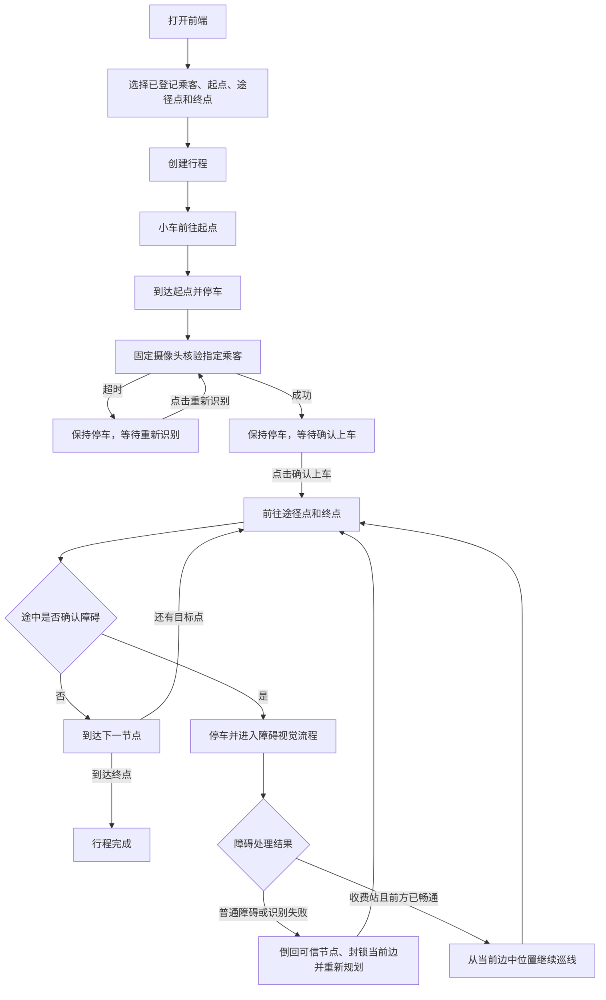

# 当前完整业务流程说明

> 文档状态：当前实现说明，不是开发计划。
>
> 核对日期：2026-07-15。
>
> 适用范围：当前 `main` 分支的前端、业务后端、固定摄像头视觉任务和网格导航流程。

## 1. 这份文档解决什么问题

这份文档只回答一件事：**用户现在操作系统后，小车实际上会按什么顺序运行，遇到不同情况会怎样处理。**

它不记录已经废弃的摄像头云台方案，不讨论后续阶段计划，也不代替各硬件参数的实机标定文档。低层循迹、转向和倒车动作的细节，继续参见《当前网格导航行进逻辑与状态机.md》；参数的调整方法，继续参见参数与实机调试文档。

当前业务的四条核心规则是：

1. 一个后端进程同一时间只允许有一个活动行程。
2. 人脸、颜色和二维码都使用固定角度摄像头，不允许转动摄像头云台。
3. 人脸识别和障碍视觉识别期间，小车必须保持停车。
4. 只有指定乘客验脸成功并点击“确认上车”后，小车才会离开起点继续行程。

## 2. 一次完整行程的主流程



这张图中的“重新规划”不保证一定存在新路线。如果封锁当前边后 A* 找不到可通行路径，行程会进入 `failed`，不会假装已经到达下一个节点。

## 3. 后端启动与叫车前置条件

### 3.1 后端启动时做什么

后端启动时会：

- 初始化电机、巡线、超声波和网格导航硬件。
- 用配置中的稳定 V4L2 路径探测一次固定摄像头：打开、读取一帧、立即释放。
- 从 `captures/faces/` 加载人脸样本，形成可选择的乘客列表。
- 初始化人脸核验、障碍颜色识别、二维码识别和收费站畅通确认任务。
- 初始化障碍记录和人脸核验记录的磁盘存储；真正查询记录或图片时再读取对应文件。

启动时的摄像头探测只提供最近一次健康状态，**不会长期占用摄像头，也不会决定摄像头以后是否还能使用**。即使启动探测失败，到达真正的视觉场景时仍会重新打开摄像头并尝试读取。

### 3.2 前端打开时做什么

前端页面初始化时会同时读取：

- 5×5 网格和可选点位；
- 已成功加载的乘客标签；
- 小车当前可信位置和朝向；
- 当前活动行程；
- 已保存的障碍记录。

如果同一后端进程中已有活动行程，刷新浏览器后可以恢复乘客、路线、状态、最新验脸照片和当前可用按钮。这个恢复依赖后端内存，**后端重启后不会恢复未完成的行程线程**。

### 3.3 什么情况下可以创建行程

前端提交的请求固定为：

```json
{
  "passenger_id": "Alice",
  "start": "A1",
  "waypoints": ["C2"],
  "end": "E5"
}
```

四个字段全部必填，不接受额外字段。当前约束包括：

- `passenger_id` 必须严格等于后端启动时成功加载的某个人脸标签。
- 起点、途径点和终点必须是合法网格点，途径点最多 3 个。
- 路线中不能出现不符合当前点位契约的重复或冲突设置。
- 导航硬件、人脸数据集、障碍视觉或收费站确认任务未初始化时，拒绝创建行程。
- 已有活动行程时，拒绝再创建第二个行程。

摄像头启动探测失败不会单独阻止创建行程。真正到达验脸或障碍识别场景后，任务会在自己的时间期限内重新尝试摄像头。

创建成功后，前端锁定乘客和路线输入，后端使用一条行程线程完成接客、验脸、等待确认、导航和障碍处理，不另外启动第二条导航线程。

## 4. 接客与指定乘客核验

### 4.1 前往起点

行程创建后状态为 `to_pickup`。后端从小车的当前可信网格点规划到起点，并在每次真正到达节点后更新当前位置和进度。

如果小车创建行程时已经位于所选起点，不会为了形式再移动一次，而是直接进入停车验脸流程。

到达起点后，导航动作已经刹车。后端记录到达事件，并异步尝试发送起点通知邮件；邮件成功或失败只形成消息事件，不改变行程是否继续。

### 4.2 一次人脸核验怎样运行

状态变为 `verifying_passenger` 后，固定摄像头执行一次最长 20 秒的连续核验：

- 第一次需要图像时才打开摄像头，后续帧复用同一个句柄。
- 只核验本次行程选择的 `passenger_id`。
- 识别距离阈值为 `0.31`。
- 指定乘客连续匹配 2 帧才算成功。
- 看到其他已登记乘客、没有识别到指定乘客或连续匹配中断时，连续计数重新开始。
- 单次读帧失败会释放失效句柄，约 0.1 秒后在本次 20 秒期限内重新打开并继续尝试。
- 成功、超时、取消或异常结束后都会释放摄像头。

因此，“某一帧读取失败”不等于本次验脸立即失败，更不等于后续场景永远无法使用摄像头。本次期限内始终没有得到足够的有效识别结果，才按核验超时处理。

### 4.3 验脸超时

超时后状态变为 `waiting_passenger_retry`：

- 小车继续在起点停车。
- 页面显示“重新识别”和“取消行程”。
- 不会自动发车，不会自动取消，也没有等待时限。
- 点击“重新识别”后，仍使用同一个行程 ID，重新进入一次完整的 20 秒核验。

超时记录优先保存本次检测到人脸时最接近阈值的诊断帧；如果从未检测到人脸，则使用最后一张有效帧。没有任何有效帧时仍按超时处理，而不是永久禁用摄像头。

### 4.4 验脸成功与确认上车

验脸成功后状态变为 `awaiting_boarding_confirmation`：

- 小车仍然在起点停车。
- 前端显示识别照片和“确认上车”按钮。
- 等待确认不限时。
- 只有点击“确认上车”后，状态才变为 `in_trip`，原行程线程才继续运行。

如果识别结论成功但 JPEG 保存失败，页面会提示照片保存失败，仍允许确认上车。保存失败不会推翻人脸匹配结论，也不会自动触发车辆动作。

## 5. 上车后的导航与到点事件

确认上车后，小车按以下顺序前往目标：

```text
途径点 1 → 途径点 2 → 途径点 3 → 终点
```

没有设置途径点时直接前往终点。每个目标段都由当前位置重新规划路径，不依赖前端预先写死具体转弯动作。

后端只在巡线确实到达节点后更新“可信位置”。边中行驶、正在识别障碍或倒车尚未恢复完成时，不会把目标节点伪造成当前位置。

到达每个途径点后：

- 更新行程进度；
- 产生“已到达途径点”事件；
- 异步尝试发送途径点通知邮件；
- 继续前往下一个目标。

到达终点后状态变为 `arrived`，释放活动行程名额，并异步尝试发送终点通知邮件。

## 6. 障碍识别与决策流程

### 6.1 什么时候进入障碍流程

小车在一条规划边上巡线时，超声波必须得到连续的新障碍读数，才确认前方存在障碍。确认后导航层先执行刹车，再调用上层视觉决策。

视觉决策开始前，小车已经停车；颜色和二维码识别过程中也保持停车。

### 6.2 先识别颜色

状态首先变为 `classifying_obstacle`。固定摄像头在最长 15 秒内识别障碍上的红色或蓝色标记：

- 同一种明确颜色连续确认 3 帧后才接受结果。
- 红色代表普通障碍，颜色阶段结束，不再扫描二维码。
- 蓝色只代表“可能是收费站”，还必须进入二维码阶段确认。
- 颜色冲突、超时、算法错误或一直没有有效摄像头帧都属于视觉识别失败。
- 短暂读帧失败会在当前 15 秒期限内释放并重新打开摄像头继续尝试。

颜色与二维码属于同一个障碍视觉任务。摄像头正常时，两阶段复用同一个句柄；只有发生读帧错误时才释放失效句柄并重新打开。

### 6.3 蓝色障碍再识别二维码

蓝色连续确认后，状态变为 `scanning_toll_qr`，二维码阶段有独立的最长 15 秒期限。

有效二维码内容必须严格符合：

```text
TOLL:<收费站编号>
```

只有蓝色标记和合法收费站二维码同时成立，障碍才被认定为收费站。二维码超时、内容不合法、算法错误或一直没有有效帧，都不允许把障碍当作收费站放行。

### 6.4 普通障碍或视觉识别失败

以下情况统一选择安全动作 `block_and_recover`：

- 红色普通障碍；
- 颜色冲突或颜色超时；
- 蓝色但没有扫到合法二维码；
- 摄像头在该阶段始终不可用；
- 颜色或二维码算法报错。

处理顺序是：

1. 把当前边加入本次导航的动态封锁集合。
2. 小车沿原边倒回这条边的起始可信节点。
3. 倒车恢复成功后，从该可信节点重新运行 A*。
4. 有新路线则继续；无路线或倒车恢复失败则行程进入 `failed`。

“识别失败按普通障碍处理”只表示采用相同的封边倒回策略。记录中仍会保存真实的 `classification_status` 和 `recognition_error`，不会伪造为成功识别出红色。

### 6.5 收费站与自动放行

合法收费站识别成功后，状态变为 `waiting_toll_clearance`，前端提示“即将通过收费站”。此时：

- 小车保持停车；
- 不显示人工“确认移走”按钮；
- 用户手动移走收费站障碍物；
- 后端使用超声波的新读数自动判断前方是否已经畅通。

进入等待状态时会先记住当前超声波读数序号，因此等待前缓存的旧数据不能直接放行。随后只统计更新后的读数：距离不小于 20 cm 且未被判定为障碍，连续满足 3 次后才确认畅通。

确认畅通后选择 `continue_current_edge`：

- 不封锁当前边；
- 不重新转向；
- 不重新执行离开节点动作；
- 从停车的边中位置重新启动巡线；
- 使用一份新的完整边行驶超时预算。

续走途中如果再次确认障碍，会重新进入同一套颜色和二维码决策流程，不会忽略第二个障碍。

收费站等待最长 60 秒。超时、超声波读取错误或用户在等待期间取消行程时，不能直接向前放行，而是改为封锁当前边并倒回可信节点。

## 7. 取消、失败和服务关闭

取消行为取决于小车当前所处的物理位置，而不只是页面上的按钮：

| 当前场景 | 取消后的行为 |
|---|---|
| 起点验脸、等待重试、等待确认上车 | 小车本来就在可信节点停车，直接结束为 `canceled` |
| 正常边上行驶 | 状态变为 `canceling`，继续到前方下一个可信节点停车，再结束为 `canceled` |
| 障碍识别或收费站等待 | 停止当前识别/等待，封锁当前边并倒回起始可信节点，再结束为 `canceled` |
| 服务关闭 | 唤醒等待线程并立即执行紧急停止，行程结束为 `canceled` |

导航无路、倒车恢复失败、边中续走失败或未预期业务异常会使行程进入 `failed`。前端显示错误信息并停止把该行程当作活动行程，但不能仅根据网页状态反推出小车的真实物理位置；实机异常时仍应先观察车辆是否已停车。

## 8. 摄像头的真实生命周期

当前摄像头资源边界是“按视觉场景持有”，不是“后端启动后永久持有”，也不是“每读取一帧重新打开一次”。

```text
后端启动探测：打开 → 读一帧 → 释放

进入一次视觉任务：
按需打开 → 连续 read() 并复用句柄
          ↓ 某次读取失败
       释放失效句柄 → 在任务期限内再次打开
          ↓
成功 / 超时 / 取消 / 异常 → 释放

下一个视觉场景：重新打开一个新句柄
```

这里的“句柄”可以理解为当前进程打开摄像头后，操作系统交给程序的那条设备访问通道。复用句柄可以连续取帧；释放句柄后，程序不再占用这条访问通道。

`/api/health` 中：

- `camera_ready=true`：最近一次探测、打开或读帧成功。
- `camera_ready=false`：最近一次摄像头操作失败。
- `camera_error`：最近一次失败原因，后续成功后清空。

它们是“最近结果”，不是摄像头此刻持续在线的监控，也不表示后端当前一定持有摄像头句柄。

当前人脸和障碍业务保存的是识别任务实际选中的内存帧，可以在摄像头释放后再写成 JPEG；写文件失败不会把摄像头标记为故障。`BackendCamera.capture()` 仍保留给独立的一次性拍照调用，它每次打开、拍摄并释放，不参与连续识别循环。

## 9. 记录、照片和页面恢复

### 9.1 人脸核验记录

每次完整的成功或超时核验最多保存：

- 一张本次选中的原始 JPEG；
- 一份同名严格 JSON 记录。

行程响应只指向该行程最新一次核验记录。JSON 成功但 JPEG 失败时仍保留记录 ID，图片地址为空；取消中的未完成核验不保存记录。

### 9.2 障碍记录

障碍处理结束后记录以下事实：

- 所属行程和障碍所在网格边；
- 确认障碍时的距离；
- 识别出的颜色、障碍类型和收费站编号；
- 识别是否成功及失败原因；
- 最终是边中续走、封边重规划、取消后恢复还是恢复失败；
- 是否倒回、倒回到哪个可信节点；
- 对应照片是否真实保存成功。

障碍 JSON 和照片保存在磁盘中，因此后端重启后仍可在记录列表中读取。记录或图片保存失败只产生系统消息，不改变已经作出的导航安全决策。

### 9.3 前端轮询

活动行程中，前端周期性读取行程状态、消息事件和小车状态。接客操作区只在对应状态出现：

- `verifying_passenger`：显示正在识别，不显示确认按钮；
- `waiting_passenger_retry`：显示“重新识别”；
- `awaiting_boarding_confirmation`：显示照片和“确认上车”；
- 其他状态：隐藏接客操作区。

障碍事件带有记录 ID 时，前端重新读取障碍列表并展示相应图片和处理结果。

## 10. 行程状态对照表

| 状态值 | 用户能看到的含义 | 小车应处于的行为 |
|---|---|---|
| `to_pickup` | 正在前往起点 | 按规划路径行驶 |
| `verifying_passenger` | 正在识别指定乘客 | 起点停车 |
| `waiting_passenger_retry` | 本次识别超时，等待重试 | 起点停车，无限期等待 |
| `awaiting_boarding_confirmation` | 验脸成功，等待确认上车 | 起点停车，无限期等待 |
| `in_trip` | 正在前往途径点或终点 | 正常导航 |
| `classifying_obstacle` | 正在识别障碍颜色 | 障碍前停车 |
| `scanning_toll_qr` | 蓝色障碍正在扫描二维码 | 障碍前停车 |
| `waiting_toll_clearance` | 收费站已识别，等待前方畅通 | 障碍前停车 |
| `canceling` | 已收到取消请求，正在安全结束 | 到节点停车或倒回可信节点 |
| `arrived` | 已到达终点 | 停车，终态 |
| `failed` | 行程因错误无法继续 | 终态，需要检查实机停车情况 |
| `canceled` | 行程已取消 | 停车，终态 |

## 11. 当前前后端接口地图

| 接口 | 用途 |
|---|---|
| `GET /api/health` | 查看后端、导航硬件和摄像头最近健康状态 |
| `GET /api/grid` | 获取 5×5 网格点位 |
| `GET /api/car/status` | 获取小车当前可信位置、朝向和活动行程 |
| `GET /api/passengers` | 获取启动时成功加载的乘客标签 |
| `POST /api/rides` | 创建一个接客行程 |
| `GET /api/rides/active` | 刷新页面时恢复当前活动行程 |
| `GET /api/rides/{ride_id}` | 获取指定行程最新状态 |
| `GET /api/rides/{ride_id}/events` | 增量读取行程消息 |
| `POST /api/rides/{ride_id}/face-verification/retry` | 在等待重试状态重新验脸，不接受请求体 |
| `POST /api/rides/{ride_id}/confirm-boarding` | 验脸成功后确认上车，不接受请求体 |
| `POST /api/rides/{ride_id}/cancel` | 取消当前活动行程，可选提交 `reason` |
| `GET /api/obstacles` | 获取已保存的障碍记录 |
| `GET /api/obstacles/{record_id}/image` | 读取合法障碍记录登记的图片 |
| `GET /api/face-verifications/{record_id}/image` | 读取合法人脸记录登记的图片 |

## 12. 当前明确没有的能力

为了避免把计划误当成现状，当前业务明确不包含：

- 摄像头云台转动或自动寻找人脸、颜色、二维码；
- 浏览器中的人脸登记功能；
- 运行中热加载新增乘客；
- 收费站人工确认按钮；
- 摄像头后台常驻采集线程、任务队列或永久重连服务；
- 多个并发行程或多个并行视觉任务；
- 后端重启后恢复未完成行程；
- 仅凭蓝色标记、无合法二维码就放行收费站；
- 视觉识别失败后继续向障碍物前进。

仍保留的“车体原地转向拍全景”是独立人工工具。它控制车体旋转，不是摄像头云台动作，也不属于上述自动行程业务。

## 13. 一遍完整课程验收应观察什么

不追求企业级压力测试时，一遍完整演示至少要看见以下因果关系：

1. 页面能选择已登记乘客并成功创建行程。
2. 小车到起点后停车，非指定乘客不能通过，指定乘客成功后仍不发车。
3. 点击“确认上车”后，小车才继续行驶。
4. 普通障碍识别后，小车倒回可信节点并改道。
5. 收费站必须同时满足蓝色和合法二维码；移走障碍后由超声波自动确认并从边中续走。
6. 最终到达终点，页面状态、当前位置、消息和障碍记录与实机动作一致。

如果这六项中任何一项的页面描述与实机动作不一致，应先按实机动作和后端日志判断，不要仅以接口返回成功作为验收依据。

## 14. 代码事实来源

本文主要按以下当前源码核对：

- `src/server/app.py`：后端装配、启动探测和 HTTP 接口；
- `src/server/ride_service.py`：完整行程线程、接客、障碍决策、取消和到点事件；
- `src/server/runtime_state.py`：行程状态与单活动行程约束；
- `src/server/camera_runtime.py`：摄像头按场景打开、失败释放和再次尝试；
- `src/tasks/face_verification.py`：指定乘客连续帧核验；
- `src/tasks/obstacle_visual_classification.py`：颜色与二维码顺序识别；
- `src/tasks/toll_clearance.py`：收费站前方畅通确认；
- `src/tasks/grid_navigation.py`：封边倒回与边中续走；
- `frontend/app.js`：页面初始化、轮询、恢复和接客操作区。

本文描述“当前程序怎样运行”。具体阈值若经实机标定修改，应同时更新配置、参数文档和本文中对应数值，避免业务说明再次与代码脱节。
